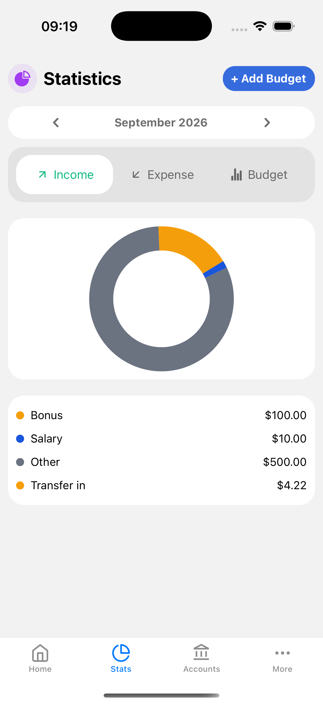
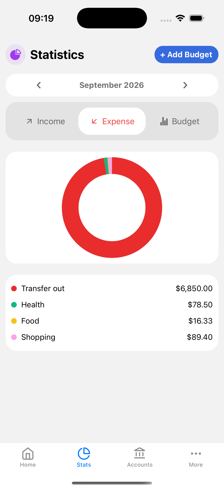
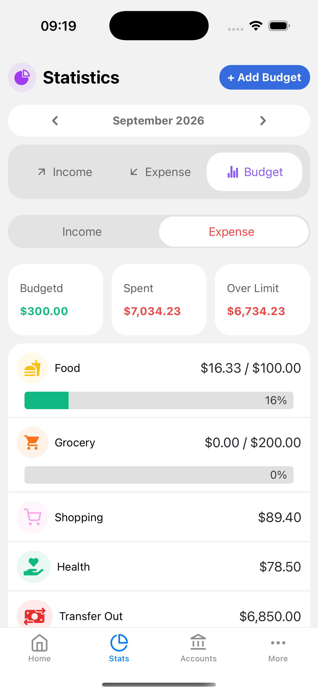

# 💰 TrackApp - Personal Finance Dashboard

A React Native app that connects to your bank accounts and gives you a real-time view of your net worth across all institutions. No manual entry, no outdated data.

## Screenshots

<table>
  <tr>
    <td align="center"><b>Home</b></td>
    <td align="center"><b>Accounts</b></td>
    <td align="center"><b>Statistics</b></td>
  </tr>
  <tr>
    <td></td>
    <td></td>
    <td></td>
  </tr>
  <tr>
    <td align="center"><b>Budget</b></td>
    <td align="center"><b>Add Transaction</b></td>
    <td align="center"><b>Login</b></td>
  </tr>
  <tr>
    <td></td>
    <td></td>
    <td></td>
    <td></td>
    <td></td>
  </tr>
</table>

## What It Does

- **Link your banks** via Plaid (checking, savings, credit cards)
- **Auto-sync transactions** every minute in the background
- **See your net worth** instantly (Assets - Liabilities)
- **Track budgets** by category, with progress bars and over-limit warnings
- **Visualize spending** with pie charts broken down by category
- **Edit transactions** if something's wrong
- **Disconnect banks** anytime with automatic cleanup

## How to Run

1. Clone it:
```bash
git clone https://github.com/kamanliu/personal-finance-app.git
cd personal-finance-app
```

2. Install dependencies:
```bash
npm install
```

3. Add your environment variables (`.env`):
```
EXPO_PUBLIC_SUPABASE_URL=your_url
EXPO_PUBLIC_SUPABASE_ANON_KEY=your_key
```

4. Start it:
```bash
npx expo start
```

5. Scan the QR code with Expo Go on your phone

## Tech Stack

- **Mobile:** React Native + Expo + Expo Router
- **Backend:** Supabase (PostgreSQL + Edge Functions)
- **Banking:** Plaid API
- **Real-time:** Supabase Realtime (WebSockets)
- **Language:** TypeScript
- **State:** React Context API

## How It Actually Works

When you link a bank:
1. Plaid Link UI handles authentication securely
2. We exchange the public token for an access token
3. Fetch all your accounts and transactions
4. Tell Plaid to send us webhooks whenever something changes

When a transaction arrives:
1. Plaid webhook hits our function immediately
2. We add a job to `sync_queue` table
3. Every minute, the cron job picks up pending jobs
4. Fetches latest transactions from Plaid
5. Updates the database
6. Your app gets a real-time notification and refreshes instantly

If something crashes during sync, the job gets marked as failed (not stuck forever).

Plaid categories (like `FOOD_AND_DRINK`, `PERSONAL_CARE`) get normalized into the app's own category set on ingest, so manually-added and bank-synced transactions share the same categories, icons, and budgets.

## Current Features

- Link multiple banks at once ✔︎
- Real-time transaction syncing (every minute) ✔︎
- Auto-update UI when new data arrives ✔︎
- Edit/delete transactions ✔︎
- View net worth (Assets vs Liabilities) ✔︎
- Filter transactions by month, account, or category ✔︎
- Budget tracking with progress bars ✔︎
- Spending breakdown by category (pie charts) ✔︎
- Disconnect banks with cascade delete ✔︎
- Full error recovery (no zombie jobs) ✔︎
- Proper handling of credit cards as liabilities ✔︎

## What's Not Done Yet

- Bill reminders
- Multi-currency support
- Export data (CSV/PDF)

## Database Setup

If you're setting up Supabase from scratch, run these in the SQL editor:

```sql
-- Enable extensions
CREATE EXTENSION IF NOT EXISTS pg_cron;
CREATE EXTENSION IF NOT EXISTS pg_net WITH SCHEMA extensions;

-- Enable real-time for these tables
ALTER PUBLICATION supabase_realtime 
ADD TABLE accounts, transactions, plaid_items, sync_queue;
```

Then create the tables. Check the migration files for the full schema.

## Edge Functions You Need

Deploy these to Supabase:

- `plaid-link-token` - generates link tokens for new bank connections
- `create-update-link-token` - generates update-mode tokens for reconnecting
- `plaid-exchange-token` - exchanges public tokens for access tokens
- `sync-transactions` - fetches and inserts transactions
- `plaid-disconnect` - removes a bank connection
- `plaid-webhook` - receives Plaid notifications
- `process-sync-queue` - the background worker that processes jobs
- `set-webhooks` - registers/updates the webhook URL on existing items
- `refresh-transactions` - manually triggers a Plaid refresh

Deploy with: `supabase functions deploy <name>`

### Required secrets

Set these via `supabase secrets set`:
```
PLAID_CLIENT_ID=
PLAID_SECRET=
ENVIRONMENT=sandbox   # or "production"
CRON_SECRET=
SUPABASE_URL=
SUPABASE_SERVICE_ROLE_KEY=
```

`ENVIRONMENT` controls which Plaid API (`sandbox.plaid.com` vs `production.plaid.com`) every function talks to — switch by updating this one secret plus the matching `PLAID_SECRET` for that environment, then redeploy.

## Testing

Run `npx tsx scripts/test-webhook.ts` to simulate a Plaid webhook and manually trigger a sync for a linked bank, without waiting for a real bank event.

## Troubleshooting

**Transactions not syncing?**
- Check the `sync_queue` table to see if jobs are failing
- Look at Edge Function logs: `supabase functions logs process-sync-queue`
- Make sure Realtime is enabled on the transactions table

**Button not showing "Syncing..."?**
- Make sure `sync_queue` is in your Realtime publications
- Check that the user_id is being passed correctly

**Balance looks wrong?**
- Credit cards should show as negative (they're debts)
- Make sure accounts are linked to the right transactions

**`INVALID_API_KEYS` from Plaid?**
- Your `PLAID_SECRET` doesn't match the environment in `ENVIRONMENT` (sandbox secret ≠ production secret) — re-check both in Supabase secrets

## Key Design Decisions

**Queue-based syncing:** We don't call sync directly from the webhook. Instead, the webhook just adds a job to a queue. Every minute, a cron job picks up one job at a time, claims it (atomic update), syncs it, and marks it done. This prevents duplicate syncs and handles failures gracefully.

**Real-time listeners in context:** Instead of each screen fetching data separately, we listen for database changes in the `AccountContext` and call `refreshData()` automatically. This means all screens get updated at the same time without any manual refresh.

**Webhook validation:** Every webhook from Plaid includes a signature. We verify it matches our secret before processing anything.

**Category normalization:** Manual entries and Plaid-synced transactions can arrive with different category formats (`"Food"` vs `"FOOD_AND_DRINK"`). A normalization layer maps both into one shared category set, so budgets and icons stay consistent regardless of source.